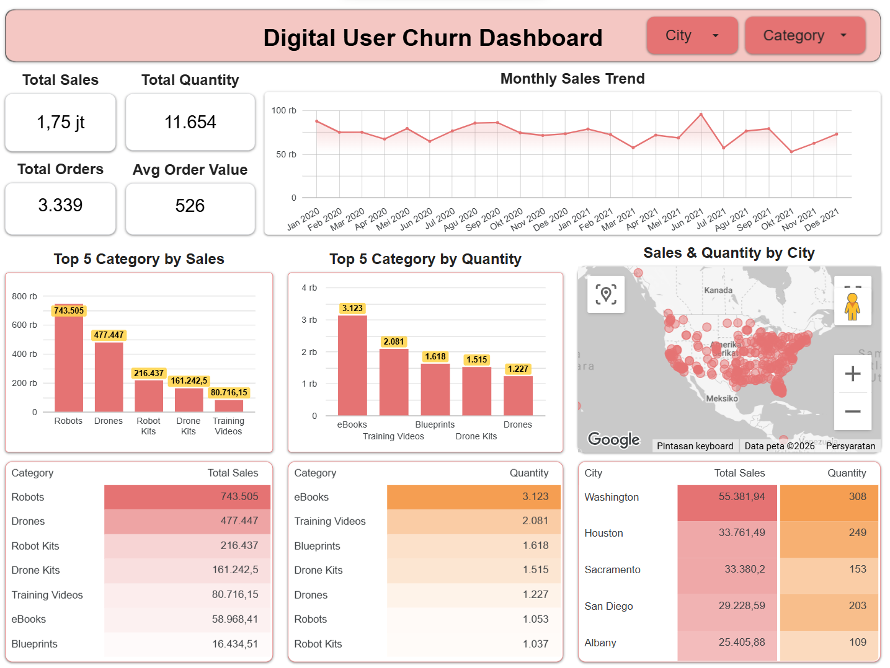

# Final Task: BI Analyst — Bank Muamalat x Rakamin Academy

This repository contains the final project submitted as part of the **Business Intelligence Analyst Project Based Internship Program** by Rakamin Academy x Bank Muamalat.

## Case Study

PT Sejahtera Bersama needs an analysis of its sales performance based on transaction data collected over several periods. Using four datasets — Customers, Products, Orders, and ProductCategory — this project builds a set of visualizations to show:

- Total overall sales
- Total sales by product category
- Total quantity sold by product category
- Total sales by city
- Total quantity sold by city
- Top 5 product categories by sales
- Top 5 product categories by quantity sold

From these visualizations, the goal is to identify patterns in the data and use them to come up with practical recommendations that could help maintain or increase sales going forward.

## Workflow

1. **Determine Primary Keys** — validated each table's primary key using `COUNT(*)` vs `COUNT(DISTINCT column)` plus a null check.
2. **Identify Relationships** — mapped out the relationships between the 4 tables (all one-to-many) and built an ERD.
3. **Build a Master Table** — joined all 4 tables in BigQuery into a single master table, sorted by transaction date.
4. **Build a Dashboard** — visualized the master table in Looker Studio.
5. **Business Recommendation** — derived insights from the dashboard and proposed recommendations to maintain or increase sales.

## Dashboard Preview

The full interactive dashboard can be accessed [here](https://datastudio.google.com/reporting/7e70eac4-aa6c-46ef-bbbe-f53eebd40191)

## Insights

- Total sales reached **$1,754,750.57**, with **11,654 units** sold overall.
- **Robots, Drones, Robot Kits, Drone Kits, and Training Videos** are the top categories by sales. By quantity sold, **eBooks, Training Videos, Blueprints, Drone Kits, and Drones** lead instead.
- **Washington** is the top-performing city by both sales and order quantity.
- The monthly sales trend shows some instability since 2020, with more noticeable fluctuations throughout 2021.

## Recommendations

- Bundle high-value, low-frequency categories (Robots, Drones) with low-value, high-frequency ones (eBooks, Training Videos) to increase average order value.
- Focus marketing efforts on top-performing cities (Washington, Houston, Sacramento).
- Prioritize stock availability for the most frequently ordered products, not just the highest-value ones.
- Investigate the cause of sales fluctuations in 2021.
- Consider tracking repeat purchases to distinguish growth from new vs. returning customers.

## Tools Used

- **Google BigQuery** — data storage, cleaning, and querying (JOINs, aggregation)
- **Looker Studio** — dashboard and data visualization

